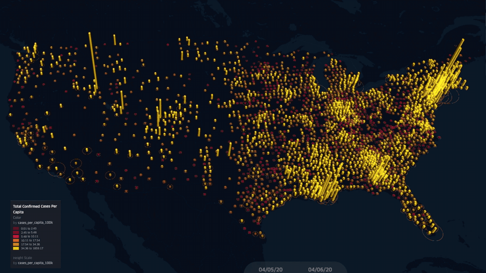

# Enriched Covid19 Data

nytimes dataset enriched with county shapes, county center point coordinates, 2019 census population estimates, county population densities, cases and deaths per capita, and calculated per day cases / deaths metrics.

## Files
- **covid19_us_county.csv:** contains all new yorks times COVID19 data over time per county, including per capita calculations, and population estimates

- **us_county_pop_and_shps.csv:** contains county population estimates and geospatial info. (No COVID-19 related data). This data can be used to join on the COVID19 reported data per county. Included since smaller file size

## Data Sources (Input Data)
- Covid19 data: https://github.com/nytimes/covid-19-data/
- **UScounties/** - County shapes: https://community.esri.com/thread/24614
- **co-est2019-alldata.csv** - County population estimates: https://www2.census.gov/programs-surveys/popest/datasets/2010-2019/counties/totals/
- **census-landarea-all.csv** - County population density (population per square mile): https://github.com/ykzeng/covid-19/tree/master/data

## Column Details
- **date**: 
- **county**: county name
- **state**: state name
- **fips**: county full fips code
- **state_fips**: state fips code
- **county_fips**: county fips code
- **cases**: total confirmed cases
- **deaths**: total confirmed deaths
- **new_day_cases**: new confirmed cases since the previous day
- **new_day_deaths**: new confirmed deaths since the previous day
- **cases_per_capita_100k**: total confirmed cases per capita multiplied by 100,000
- **deaths_per_capita_100k**: total confirmed deaths per capita multiplied by 100,000 
- **new_day_cases_per_capita_100k**: confirmed new day cases per capita multiplied by 100,000
- **new day_deaths_per_capita_100k**: confirmed new day deaths per capita multiplied by 100,000
- **new county_pop_2019_est**: 2019 census county population estimates
- **'pop_per_sq_mile_2010'**: 2010 census county population density estimates (populate per square mile)
- **new center_point**: centroid center coordinate of the county geometry 
- **new county_center_lat**: latitude of center_point
- **new county_center_lon**: longitude of center_point
- **new county_geom**: county shape geometry

## Notes
- Please review nytimes README for detailed notes on Covid-19 data - https://github.com/nytimes/covid-19-data/
- The only update I made in regards to 'Geographic Exceptions', is that I took 'New York City' county provided in the Covid-19 data, which has all cases for 'for the five boroughs of New York City (New York, Kings, Queens, Bronx and Richmond counties) and replaced the missing FIPS for those rows with the 'New York County' fips code 36061. That way  I could join to a geometry, and then I used the sum of those five boroughs population estimates for the 'New York City' estimate, which allowed me calculate 'per capita' metrics for  'New York City' entries in the Covid-19 dataset

## Visualizations and Analysis Examples

[COVID-19 U.S. Time-lapse: Confirmed Cases per County (per capita)](https://www.reddit.com/r/dataisbeautiful/comments/fxqh6u/oc_covid19_us_timelapse_confirmed_cases_per/)

## UPDATE - 4.21

The file structure slightly has changed. **covid19_us_county.csv:** no longer has the geometry information per county in it, the file size was over 100MB due to inefficient repition of geometry for every row. You can do a simply join to the **us_county_pop_and_shps.csv:** file on the fips column if needed.
